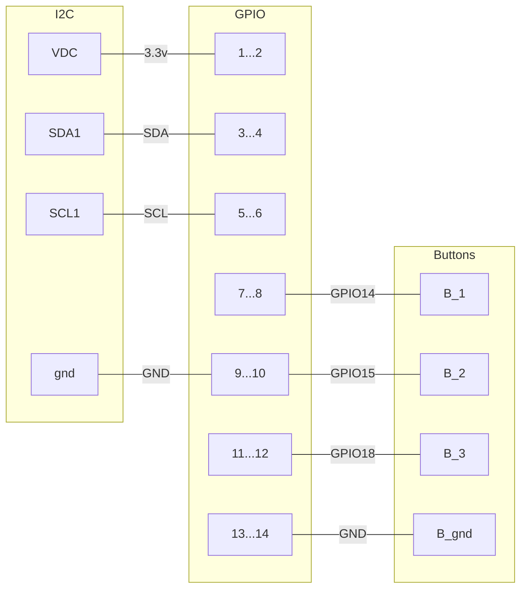

# Raspberry Pi Wiring connections

# PCA 9685 Connection Schema
| PCA 9685  | Pro Micro | _notes_               |
|:---------:|:---------:|-----------------------|
| **GND**   | GND       |                       |
| **OE**    | __        | _not connected_       |
| **SCL**   | SCL       | _ProMicro SCL_        |
| **SDA**   | SDA       | _ProMicro SDA_        |
| **VCC**   | RAW       | _5v input from RAW_   |
| **V+**    | __        | _not connected_       |
