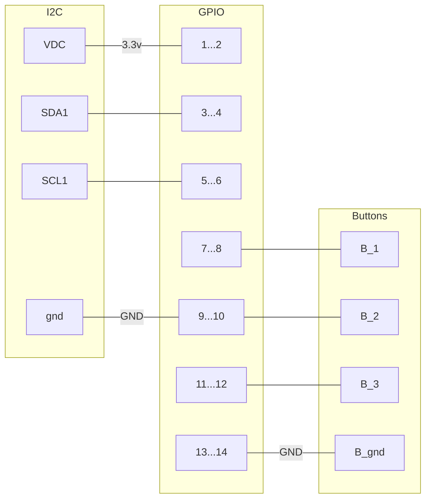

# Raspberry Pi Wiring connections

```mermaid
flowchart LR
    VDC  ---|3.3v| 1...2
    SDA1 ---       3...4
    SCL1 ---       5...6
                   7...8  --- B_1
    gnd  ---|GND | 9...10 --- B_2
                  11...12 --- B_3
                  13...14 ---|GND| B_gnd

    subgraph GPIO
         1...2
         3...4
         5...6
         7...8
         9...10
        11...12
        13...14
    end
    subgraph I2C
        VDC
        SDA1
        SCL1
        gnd
    end
    subgraph Buttons
        direction LR
        B_1
        B_2
        B_3
        B_gnd
    end
```
